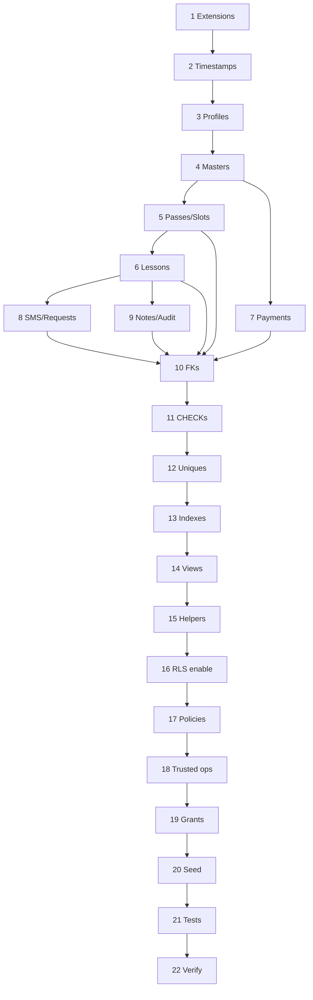

# Database Migration Plan — REVE ACADEMY OS

Phase **0B-2** future migration ordering. **No migration files in this phase.**

Tooling assumption: Supabase CLI migrations or equivalent versioned SQL in repository (Phase 0B-3+).

---

## Migration safety requirements

- No production personal data in migrations
- No service-role keys in repository
- Every migration deterministic and reviewable
- Order immutable after shared deployment
- Fix deployed migrations with **forward** migrations only
- Local unreleased migrations replaceable only before shared use
- Destructive changes require Owner approval + backup verification
- Historical table DELETE prohibited
- RLS enabled before production client access
- Least-privilege grants

---

## Phase 0B-3 gate — Provisional decision review (OD-14 ~ OD-21)

**Before Phase 0B-3 creates executable migrations**, development must pause for a **concise Owner review** of OD-14 through OD-21 ([open-decisions.md](./open-decisions.md)).

| Requirement | Detail |
|-------------|--------|
| Status | OD-14 ~ OD-21 are **Provisional** (2026-06-26), not permanent Confirmed requirements |
| Purpose | Avoid irreversible or difficult-to-change constraints based on unreviewed defaults |
| UI review | Related UI phases may revise **presentation and workflow** without immediate schema change |
| Schema changes | Any revision affecting CHECK constraints, RLS, or trusted-operation behavior must be applied **before production data migration** |
| Documents to sync | physical design, trusted-operation contracts, database test plan, migration plan |

Provisional defaults in use for planning are documented in architecture files with label: **Provisional policy — subject to owner review before executable migration**.

---

## Stage overview

| # | Stage | Purpose |
|---|-------|---------|
| 1 | Extensions and prerequisites | Required extensions, roles baseline |
| 2 | Timestamp helper design | `reve_set_updated_at()` function stub |
| 3 | Profiles and Auth relationship | `profiles` + auth FK |
| 4 | Master tables | students, teachers, courses, course_products |
| 5 | Pass and schedule tables | passes, schedule_slots |
| 6 | Lesson tables | lessons |
| 7 | Payment and refund tables | payments, payment_refunds |
| 8 | SMS and request tables | sms_notifications, schedule_change_requests, lesson_schedule_changes |
| 9 | Notes and audit tables | lesson_notes, audit_logs |
| 10 | Foreign keys | All FKs including composite lesson→pass |
| 11 | Check constraints | Status and domain CHECKs |
| 12 | Unique and partial unique | Pass, lesson, slot, payment, refund |
| 13 | Indexes | Operational indexes per physical design |
| 14 | Read views | Derived read models (non-materialized) |
| 15 | Helper identity functions | RLS predicate helpers |
| 16 | RLS enablement | ENABLE ROW LEVEL SECURITY all tables |
| 17 | RLS policies | Per-table policies |
| 18 | Trusted operations | SECURITY DEFINER functions |
| 19 | Grants and revokes | authenticated, service_role least privilege |
| 20 | Seed configuration | Fixed non-personal config only when approved |
| 21 | Database tests | pgTAP or CI SQL tests |
| 22 | Rollback / forward-fix verification | Documented limitations |

---

## Stage details

### Stage 1 — Extensions and prerequisites

| Field | Detail |
|-------|--------|
| Dependencies | Empty database |
| Objects | `pgcrypto` or `uuid-ossp` if needed; document choice |
| Validation | `SELECT extname FROM pg_extension` |
| Failure | Abort; no partial schema |
| Rollback | Drop extensions if unused |
| Data | None |

### Stage 2 — Timestamp helper

| Field | Detail |
|-------|--------|
| Dependencies | Stage 1 |
| Objects | `reve_set_updated_at()` trigger function (design) |
| Validation | Test UPDATE sets `updated_at` on one stub table |
| Rollback | Drop function |
| Note | Apply triggers in Stage 4–9 per table |

### Stage 3 — Profiles and Auth

| Field | Detail |
|-------|--------|
| Dependencies | Supabase Auth schema exists |
| Objects | `profiles` table; FK `id` → `auth.users` |
| Validation | Cannot insert profile without auth user |
| Rollback | Drop profiles (dev only) |
| Data | No seed users in migration |

### Stage 4 — Master tables

| Field | Detail |
|-------|--------|
| Objects | students, teachers, courses, course_products |
| Validation | UK on codes; CHECK positives |
| Rollback | Drop in reverse dependency order (dev) |
| Preservation | RESTRICT FKs from later stages |

### Stage 5 — Pass and schedule

| Field | Detail |
|-------|--------|
| Objects | passes (composite UK), schedule_slots |
| Validation | Partial unique active/reserved pass |
| Rollback | Drop schedule_slots then passes |
| Data | Pass snapshots immutable after insert (trigger later) |

### Stage 6 — Lessons

| Field | Detail |
|-------|--------|
| Objects | lessons + composite FK to passes |
| Validation | Mismatch student/course rejected |
| Rollback | Drop lessons |

### Stage 7 — Payments and refunds

| Field | Detail |
|-------|--------|
| Objects | payments, payment_refunds |
| Validation | idempotency UK; refund payment_id UK |
| Rollback | Drop refunds then payments |

### Stage 8 — SMS and requests

| Field | Detail |
|-------|--------|
| Objects | sms_notifications, schedule_change_requests, lesson_schedule_changes |
| Validation | Append-only on schedule changes |
| Rollback | Reverse order |

### Stage 9 — Notes and audit

| Field | Detail |
|-------|--------|
| Objects | lesson_notes, audit_logs |
| Validation | No UPDATE trigger on audit |
| Rollback | Drop both |

### Stage 10 — Foreign keys (consolidation)

| Field | Detail |
|-------|--------|
| Purpose | Add any deferred FKs; verify ON DELETE actions |
| Validation | `\d+` FK list matches physical design |
| Rollback | DROP CONSTRAINT individually |
| Preservation | RESTRICT on all historical paths |

### Stage 11 — Check constraints

| Field | Detail |
|-------|--------|
| Objects | All status CHECKs; monetary; datetime sanity |
| Validation | Negative test inserts fail |
| Rollback | DROP CHECK |

### Stage 12 — Unique and partial unique

| Field | Detail |
|-------|--------|
| Objects | All UK from data-integrity-constraints |
| Validation | Duplicate insert tests |
| Rollback | DROP INDEX/CONSTRAINT |

### Stage 13 — Indexes

| Field | Detail |
|-------|--------|
| Objects | Non-constraint indexes per §9 physical design |
| Validation | EXPLAIN on representative queries |
| Rollback | DROP INDEX |

### Stage 14 — Read views

| Field | Detail |
|-------|--------|
| Objects | `reve_pass_usage_summary_v`, etc. |
| Validation | Derived counts match manual calculation |
| Rollback | DROP VIEW |
| Note | Views inherit RLS from base tables |

### Stage 15 — Identity helpers

| Field | Detail |
|-------|--------|
| Objects | `current_profile_id()`, `teacher_can_access_student`, … |
| Validation | Unit tests per role context |
| Rollback | DROP FUNCTION |
| Security | search_path fixed |

### Stage 16 — RLS enablement

| Field | Detail |
|-------|--------|
| Objects | ALTER TABLE … ENABLE ROW LEVEL SECURITY |
| Validation | Anonymous SELECT returns 0 rows |
| Rollback | DISABLE (dev only — not production) |
| **Critical** | Must complete before client connects |

### Stage 17 — RLS policies

| Field | Detail |
|-------|--------|
| Objects | All policies per rls-policy-design.md |
| Validation | RLS test suite |
| Rollback | DROP POLICY |

### Stage 18 — Trusted operations

| Field | Detail |
|-------|--------|
| Objects | All public trusted functions |
| Validation | Transaction tests |
| Rollback | DROP FUNCTION |
| Grants | service_role + controlled authenticated EXECUTE |

### Stage 19 — Grants and revokes

| Field | Detail |
|-------|--------|
| Objects | REVOKE ALL FROM PUBLIC; grant SELECT on views; table grants minimal |
| Validation | Client role cannot bypass RLS |
| Rollback | Restore grants script |

### Stage 20 — Seed

| Field | Detail |
|-------|--------|
| Objects | Optional course codes, product templates — **no PII** |
| Validation | Owner approval checklist |
| Rollback | DELETE seed rows by fixed ids |

### Stage 21 — Database tests

| Field | Detail |
|-------|--------|
| Objects | Test harness per database-test-plan.md |
| Validation | CI green |
| Rollback | N/A |

### Stage 22 — Rollback verification

| Field | Detail |
|-------|--------|
| Purpose | Document that production uses forward-fix only |
| Validation | Drill: failed migration mid-stage leaves DB consistent or fully rolled back in dev |
| Limitation | Stages 16–18 cannot be safely disabled in production with live data |

---

## Dependency graph (simplified)

---

## Related documents

- [postgresql-physical-design.md](./postgresql-physical-design.md)
- [rls-policy-design.md](./rls-policy-design.md)
- [trusted-operation-contracts.md](./trusted-operation-contracts.md)
- [database-test-plan.md](./database-test-plan.md)
