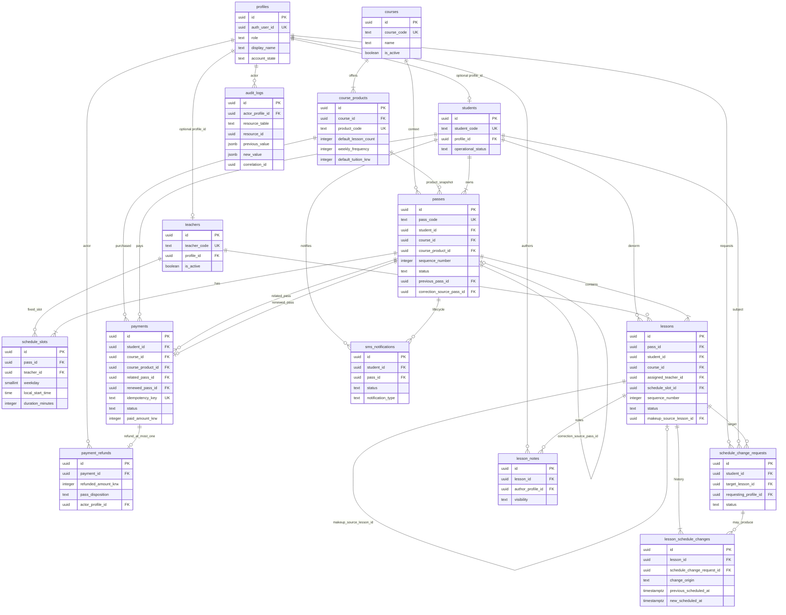

# Entity Relationship Diagram — REVE ACADEMY OS

Phase **0B-1** logical ERD. Mermaid for rendering; plain-language summary follows.

---

## Mermaid `erDiagram`

---

## Plain-language relationship summary

### Authentication and people

- Each **profile** links to at most one Supabase Auth user and carries a single application **role**.
- A **student** business record may optionally link to one profile (login). A student without a profile is still a valid enrolled student.
- A **teacher** business record may optionally link to one profile. Teaching staff can exist before login activation.

### Curriculum and products

- Each **course** is a subject or curriculum (e.g. vocal).
- Each **course_product** belongs to one course and defines the commercial package (lesson count, weekly frequency, default tuition). Multiple products may exist per course.

### Pass aggregate

- Each **pass** belongs to one student and one course, references the product used at creation, and stores **immutable snapshots** of product name, lesson count, frequency, and tuition.
- Passes are sequenced per (student, course) via `sequence_number` and exposed as immutable `pass_code` (e.g. `V-S006-001`).
- A pass may reference a **previous pass** (renewal chain) and optionally a **correction source pass** (mistaken cancel/refund correction per OD-11).
- At most **one active** and **zero or one reserved** pass exist per (student, course) at any time.

### Fixed schedule and lessons

- Each **schedule_slot** belongs to one pass and defines weekday + local start time + duration + teacher. A pass may have multiple slots (weekly twice → usually two).
- Each **lesson** belongs to one pass and copies `student_id` and `course_id` for RLS performance; these must stay consistent with the pass.
- Lessons have a sequence number unique within the pass. Status is the **only** deduction source of truth.
- A **makeup** lesson may reference a **source lesson** via self-FK; duplicate completed makeup for the same source is blocked.

### Payments and refunds

- Each **payment** belongs to a student, course, and product context. It carries a unique **idempotency key**.
- On trusted completion, payment links to at most one **renewed pass** and may reference a **related (prior) pass**.
- **payment_refunds**: **zero or one** row per payment (MVP, OD-13). Row existence means refund completed successfully. Separate historical record (OD-12). Refunds do not delete payments or passes.

### SMS

- **sms_notifications** rows tie to a student and pass. MVP uses **one primary lifecycle row per pass**; creating a new pass creates a new notification row; old pass notification history remains.

### Schedule changes

- **schedule_change_requests** target a lesson; teachers or students submit; owner approves or rejects.
- **lesson_schedule_changes** append each schedule move with previous/new timestamps and **change_origin** (direct, cascade, trusted, correction).

### Notes and audit

- **lesson_notes** attach to lessons with visibility internal vs student-visible.
- **audit_logs** append-only; optional **correlation_id** groups trusted multi-table operations.

---

## Related documents

- [data-model.md](./data-model.md)
- [schema-dictionary.md](./schema-dictionary.md)
- [data-integrity-constraints.md](./data-integrity-constraints.md)
